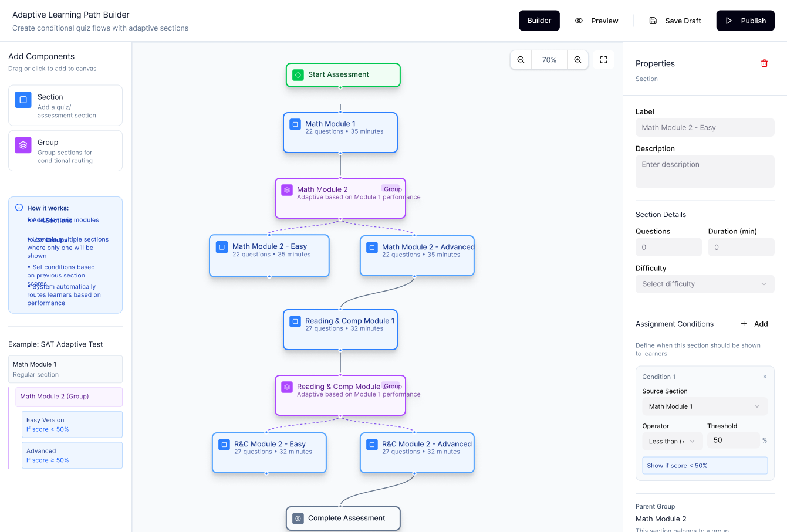

# Adaptive Learning Path Builder

A full-stack web application that allows an admin or curriculum designer to create adaptive learning paths by arranging content nodes on a canvas and defining conditional progression logic between them.



---

## 🎯 Overview

This application provides a visual, drag-and-drop interface for building adaptive learning paths. Users can:

- **Drag content components** (sections and groups) onto an interactive canvas
- **Create directed connections** between nodes to define learning flow
- **Define conditional progression rules** based on scores, completion, and other metrics
- **Save and reload** learning paths with full canvas state preservation
- **Preview the flow** before publishing

---

## 🏗️ Architecture

```
┌─────────────────┐        HTTP/JSON         ┌──────────────────────┐
│    Frontend      │ ◄─────────────────────► │       Backend         │
│  React 19 + TS   │                         │  Spring Boot 3.2.5    │
│  Vite 8 (5173)   │                         │  Java 17 (8080)       │
│                   │                         │                       │
│  • React Flow     │                         │  • REST API           │
│  • Zustand Store  │                         │  • JPA + H2 Database  │
│  • Axios Client   │                         │  • JSON blob storage  │
│  • Custom Nodes   │                         │  • Seed data (10 cmp) │
└─────────────────┘                           └──────────────────────┘
```

---

## 🛠️ Tech Stack

| Layer        | Technology                          | Version  |
|-------------|--------------------------------------|----------|
| Frontend    | React + TypeScript (Vite)            | React 19, Vite 8 |
| Canvas      | @xyflow/react (React Flow)           | v12      |
| State       | Zustand                              | v5       |
| HTTP Client | Axios                                | v1       |
| Backend     | Java + Spring Boot                   | Java 17, Spring Boot 3.2.5 |
| Database    | H2 (in-memory)                       | v2       |
| ORM         | Spring Data JPA + Hibernate          | v6       |
| Testing     | JUnit 5, MockMvc, Vitest             | 5.10 / 4.1 |

---

## 📋 Prerequisites

- **Java 17+** (OpenJDK/Temurin recommended)
- **Maven 3.8+**
- **Node.js 18+**
- **npm 9+**

---

## 🚀 Setup & Run

### 1. Clone the repository
```bash
git clone <repository-url>
cd adaptive-learning-path-builder
```

### 2. Start the Backend
```bash
cd backend
mvn spring-boot:run
```
The backend starts on **http://localhost:8080**. H2 Console available at http://localhost:8080/h2-console.

### 3. Start the Frontend
```bash
cd frontend
npm install
npm run dev
```
The frontend starts on **http://localhost:5173**. Open this URL in your browser.

---

## 🧪 Testing

### Backend (46 Tests)
```bash
cd backend
mvn clean test
```

**Test Execution Evidence:**
```text
[INFO] Tests run: 5, Failures: 0, Errors: 0, Skipped: 0, Time elapsed: 3.134 s -- in ...LearningPathControllerTest$EdgeCases
[INFO] Tests run: 3, Failures: 0, Errors: 0, Skipped: 0, Time elapsed: 0.096 s -- in ...LearningPathControllerTest$ListLearningPaths
[INFO] Tests run: 7, Failures: 0, Errors: 0, Skipped: 0, Time elapsed: 0.068 s -- in ...LearningPathControllerTest$LoadLearningPath
[INFO] Tests run: 6, Failures: 0, Errors: 0, Skipped: 0, Time elapsed: 0.088 s -- in ...LearningPathControllerTest$SaveLearningPath
[INFO] Tests run: 0, Failures: 0, Errors: 0, Skipped: 0, Time elapsed: 3.640 s -- in ...LearningPathControllerTest
[INFO] Tests run: 1, Failures: 0, Errors: 0, Skipped: 0, Time elapsed: 0.008 s -- in ...ComponentControllerTest$InvalidMethods
[INFO] Tests run: 10, Failures: 0, Errors: 0, Skipped: 0, Time elapsed: 0.102 s -- in ...ComponentControllerTest$GetAllComponents
[INFO] Tests run: 0, Failures: 0, Errors: 0, Skipped: 0, Time elapsed: 0.122 s -- in ...ComponentControllerTest
[INFO] Tests run: 6, Failures: 0, Errors: 0, Skipped: 0, Time elapsed: 0.354 s -- in ...ComponentServiceTest
[INFO] Tests run: 8, Failures: 0, Errors: 0, Skipped: 0, Time elapsed: 0.043 s -- in ...LearningPathServiceTest
[INFO] Tests run: 46, Failures: 0, Errors: 0, Skipped: 0
[INFO] BUILD SUCCESS
```

| Test Class                           | Tests | Coverage                                  |
|-------------------------------------|-------|-------------------------------------------|
| `ComponentControllerTest`           | 11    | GET /api/components, schema, 405 handling |
| `LearningPathControllerTest`       | 21    | Save, load, list, round-trip, edge cases  |
| `ComponentServiceTest`              | 6     | Service layer, metadata, type counts      |
| `LearningPathServiceTest`          | 8     | Save/load, ID generation, exceptions      |

### Frontend (45 Tests)
```bash
cd frontend
npx vitest run
```

**Test Execution Evidence:**
```text
 ✓ src/test/types/types.test.ts (11 tests) 5ms
 ✓ src/test/utils/idGenerator.test.ts (10 tests) 5ms
 ✓ src/test/store/canvasStore.test.ts (24 tests) 7ms

 Test Files  3 passed (3)
      Tests  45 passed (45)
   Start at  19:17:10
   Duration  1.08s (transform 151ms, setup 292ms, import 184ms, tests 17ms, environment 2.08s)
```

| Test File                  | Tests | Coverage                                    |
|---------------------------|-------|---------------------------------------------|
| `canvasStore.test.ts`     | 24    | Node/edge CRUD, selection, save/load        |
| `types.test.ts`           | 11    | Type contracts for all schema shapes        |
| `idGenerator.test.ts`     | 10    | UUID generation, format, uniqueness         |

### Lint & Type Check
```bash
cd frontend
npx tsc --noEmit        # TypeScript — 0 errors
npx eslint src/ --ext .ts,.tsx  # ESLint — 0 errors, 0 warnings
```

**Total: 91 tests passing, 0 lint errors, 0 type errors**

---

## 📡 API Endpoints

| Method | Endpoint                    | Purpose                     | Status |
|--------|----------------------------|-----------------------------|--------|
| GET    | `/api/components`          | Return all content modules  | 200    |
| POST   | `/api/learning-paths`      | Save a learning path        | 201    |
| GET    | `/api/learning-paths/{id}` | Load a saved learning path  | 200    |
| GET    | `/api/learning-paths`      | List all saved paths        | 200    |

> For complete API documentation including request/response schemas, see **[docs/API.md](docs/API.md)**.

### Quick Test
```bash
# Get components
curl -s http://localhost:8080/api/components | jq '.totalCount'

# Save a path
curl -X POST http://localhost:8080/api/learning-paths \
  -H "Content-Type: application/json" \
  -d '{"name":"Test Path","status":"draft","version":1,"nodes":[],"edges":[]}'

# List all paths
curl -s http://localhost:8080/api/learning-paths | jq
```

---

## 🎨 Features

### Left Panel
- **Section** card — Add quiz/assessment sections to the canvas
- **Group** card — Add groups for conditional routing
- **How it works** — Step-by-step usage guide
- **Example: SAT Adaptive Test** — Visual tree showing conditional branching (Math Module 1 → Module 2 Easy/Advanced based on score threshold)

### Interactive Canvas
- **Drag-and-drop** nodes from the left panel
- **Click-to-add** as an alternative to drag
- **Custom zoom controls** with percentage display (e.g., 100%)
- **Snap-to-grid** alignment (15×15px grid)
- **MiniMap** for navigation on large canvases
- **4 node types**: Start (green), Section/Unit (blue), Group/Assessment (purple dashed with "Group" badge), End (gray)

### Properties Panel
- **Node editing**: Label, description, questions, duration, difficulty
- **Assessment config**: Max score, passing score
- **Edge conditions**: Metric selection, comparison operators, threshold values
- **Assignment conditions**: Yellow-highlighted condition previews
- **Parent group**: Shows parent node relationship
- **Trash icon**: Delete selected node or edge

### Toolbar
- **Builder / Preview** tab toggle
- **New** — Create fresh canvas with Start/End nodes
- **Load** — Select and restore previously saved paths
- **Save Draft** — Persist canvas to backend
- **Publish** — Save with published status

---

## 📊 Seed Data

The application comes pre-loaded with 10 content components:

| ID                        | Title                              | Type       | Duration |
|--------------------------|-------------------------------------|------------|----------|
| cmp-assess-math-1        | Math Module 1 Assessment           | assessment | 35 min   |
| cmp-unit-math-2-easy     | Math Module 2 - Easy               | unit       | 35 min   |
| cmp-unit-math-2-advanced | Math Module 2 - Advanced           | unit       | 35 min   |
| cmp-assess-reading-1     | Reading & Comp Module 1            | assessment | 32 min   |
| cmp-unit-reading-2-easy  | R&C Module 2 - Easy                | unit       | 32 min   |
| cmp-unit-reading-2-advanced | R&C Module 2 - Advanced         | unit       | 32 min   |
| cmp-unit-science-1       | Science Fundamentals               | unit       | 40 min   |
| cmp-assess-final         | Final Comprehensive Assessment     | assessment | 60 min   |
| cmp-unit-writing-1       | Writing Skills Workshop            | unit       | 45 min   |
| cmp-assess-writing-1     | Writing Assessment                 | assessment | 30 min   |

---

## 📚 Library Choices & Justification

| Library          | Reason                                                                                      |
|-----------------|--------------------------------------------------------------------------------------------|
| **@xyflow/react** | Industry-standard React library for node-based graph editors. Provides pan, zoom, drag-and-drop, custom nodes, custom edges, and minimap out of the box. |
| **Zustand**      | Lightweight global state (2KB). Integrates cleanly with React Flow's state model. No boilerplate compared to Redux. |
| **Axios**        | Promise-based HTTP client with interceptors and better error handling than fetch.            |
| **H2 Database**  | Embedded, zero-config, in-memory database perfect for assessments. No external DB setup required. |
| **Vitest**       | Vite-native test runner. Fast, ESM-first, with jsdom for DOM testing.                       |
| **react-hot-toast** | Minimal toast notifications with smooth animations and accessible API.                  |

---

## 🎨 Design Decisions

1. **JSON Blob Storage**: Learning paths are stored as raw JSON blobs rather than normalized relational tables. This preserves exact canvas state (positions, zoom, offsets) without complex ORM mapping for graph structures.

2. **Custom Node Types**: Four node types (Start, Unit, Assessment, End) map directly to the schema's node types, with distinct visual styling and color coding.

3. **Conditional Rule Model**: Rules support all schema-defined metrics (completion, passed, score, score_range, time_spent_minutes, percentage_completion) with AND/OR operators and full range support.

4. **Click-to-Add**: In addition to drag-and-drop, components can be added by clicking, improving accessibility.

5. **Custom Zoom Controls**: Custom-built zoom bar replaces default React Flow controls for a cleaner UI with percentage display.

---

## ⚖️ Assumptions & Tradeoffs

1. **In-memory database**: Data resets on backend restart. For production, switch to PostgreSQL by changing `application.properties` (see [BACKEND.md](docs/BACKEND.md#production-deployment)).

2. **No authentication**: The builder is assumed to be used by authenticated admins in a production context. Auth was out of scope.

3. **No real-time collaboration**: Single-user editing assumed. WebSocket sync would be needed for multi-user.

4. **Canvas state in payload**: The zoom/offset state is stored within the learning path JSON, which allows perfect canvas restoration but couples view state with data.

---

## 📁 Project Structure

```
adaptive-learning-path-builder/
├── README.md                        # This file
├── docs/
│   ├── API.md                       # Complete API documentation
│   ├── BACKEND.md                   # Backend architecture & reference
│   ├── FRONTEND.md                  # Frontend architecture & reference
│   └── screenshot.png               # Application screenshot
├── schemas/                         # Provided JSON schema files
│   ├── available-content.schema.json
│   ├── available-content.example.json
│   ├── learning-path.schema.json
│   └── learning-path.example.json
├── frontend/                        # React + TypeScript (Vite)
│   └── src/
│       ├── api/                     # Axios API client
│       ├── components/              # React components
│       │   ├── Canvas/              # React Flow canvas + custom nodes
│       │   ├── LeftPanel/           # Component sidebar
│       │   ├── PropertiesPanel/     # Node/edge property editor
│       │   └── Toolbar/             # Top bar with actions
│       ├── store/                   # Zustand state management
│       ├── test/                    # Vitest test suites (45 tests)
│       ├── types/                   # TypeScript type definitions
│       └── utils/                   # Utilities (ID generation)
└── backend/                         # Java 17 + Spring Boot 3
    └── src/
        ├── main/java/com/nilaapps/learningpath/
        │   ├── config/              # CORS configuration
        │   ├── controller/          # REST controllers
        │   ├── dto/                 # Data transfer objects
        │   ├── exception/           # Error handling
        │   ├── model/               # JPA entities
        │   ├── repository/          # Spring Data repositories
        │   └── service/             # Business logic
        ├── main/resources/
        │   ├── application.properties
        │   └── data.sql             # Seed data (10 components)
        └── test/                    # JUnit 5 test suites (46 tests)
```

---

## 📖 Documentation

| Document                      | Description                                |
|------------------------------|---------------------------------------------|
| [README.md](README.md)       | Project overview and quick start guide      |
| [docs/API.md](docs/API.md)   | Complete REST API reference with schemas    |
| [docs/BACKEND.md](docs/BACKEND.md) | Backend architecture, entities, services |
| [docs/FRONTEND.md](docs/FRONTEND.md) | Frontend components, state, types     |

---

## ⏱️ Time Spent

| Phase                          | Time     |
|-------------------------------|----------|
| Schema analysis & planning    | 30 min   |
| Backend API + models + tests  | 1 hour   |
| Frontend setup + design system | 30 min  |
| Canvas + custom nodes + edges | 1.5 hours|
| Properties panel + conditions | 1 hour   |
| Save/load + integration       | 30 min   |
| UI alignment + polish         | 1 hour   |
| Testing (91 tests)            | 30 min   |
| Documentation                 | 30 min   |
| **Total**                     | **~7 hours** |

---

## ✅ Submission Checklist Verification

1. **Repository link:** Provided via code submission.
2. **Time spent:** Documented in [Time Spent](#️-time-spent) (~7 hours).
3. **Assumptions or tradeoffs:** Documented in [Assumptions & Tradeoffs](#️-assumptions--tradeoffs).
4. **Setup instructions:** Documented in [Setup & Run](#-setup--run).
5. **Test execution evidence:** Documented in [Testing](#-testing) showing 91/91 tests passing.
